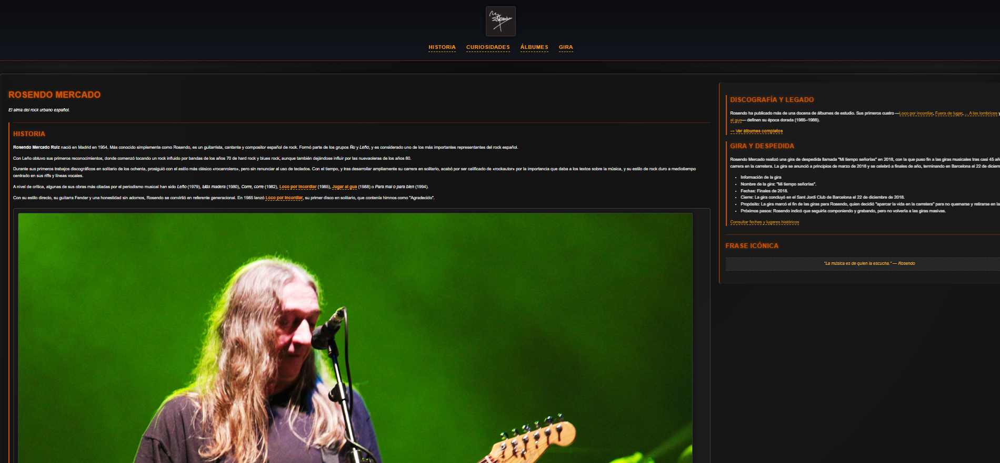
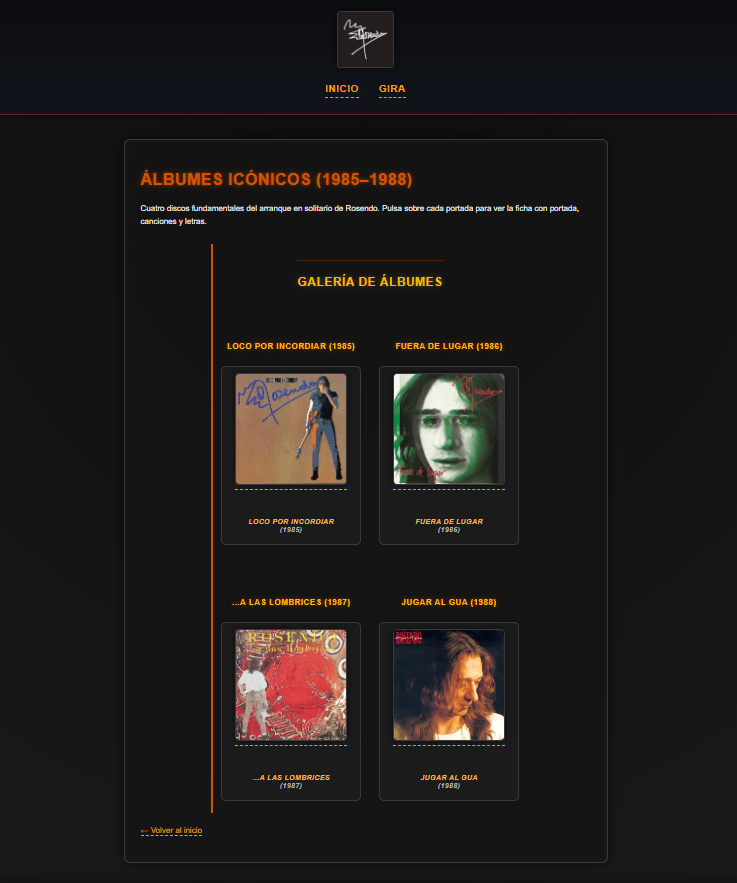
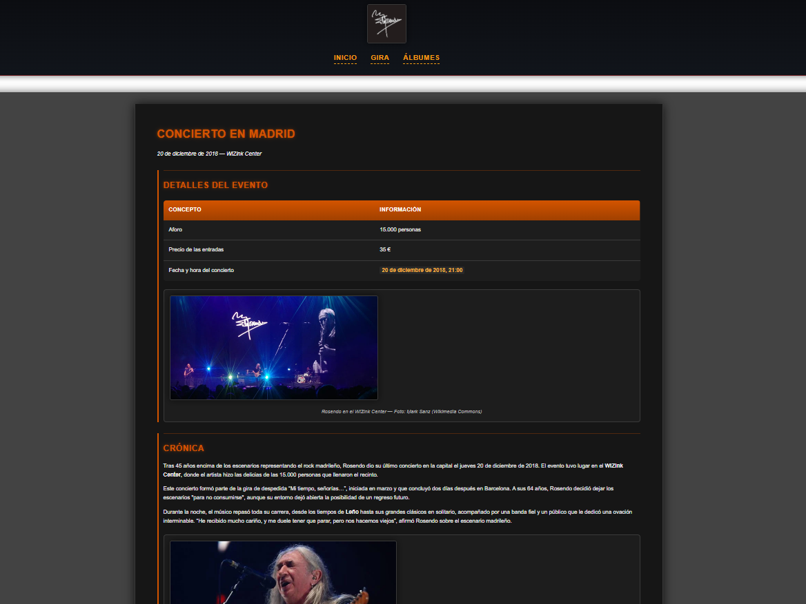

# 🎸 Rosendo Mercado - Sitio Web Homenaje

Sitio web dedicado al músico español **Rosendo Mercado**, desarrollado como Práctica Final de las Unidades Didácticas 1 y 2 del módulo **Lenguajes de Marcas y Sistemas de Gestión de Información (LIMA)**.


---

## 📖 Descripción

Este proyecto consiste en un sitio web completo sobre la vida y carrera de Rosendo Mercado, considerado uno de los más importantes representantes del rock español. El sitio incluye información sobre su historia, curiosidades, discografía y su gira de despedida "Mi tiempo, señorías..." (2018).

---

## 📁 Estructura del Proyecto

```
rosendo_web_LIMA/
├── index.html                 # Página principal (historia y curiosidades)
├── css/
│   └── estilos.css           # Hoja de estilos única
├── imagenes/                  # Recursos gráficos
├── albumes/
│   ├── index.html            # Listado de álbumes
│   ├── loco_por_incordiar/
│   ├── fuera_de_lugar/
│   ├── a_las_lombrices/
│   └── jugar_al_gua/
└── gira/
    ├── index.html            # Información de la gira
    ├── madrid/
    └── barcelona/
```

---

## ✨ Características

### UD1 - Estructura Base
- Navegación mediante anclas internas
- Imágenes con `<figure>` y `<figcaption>`
- Letras de canciones con `<pre>` y `<details>`
- Fechas marcadas con `<time datetime>`
- Enlaces con 4 estados CSS (link, visited, hover, active)
- Fondo degradado radial
- Tipografía personalizada
- Diseño responsive

### UD2 - Mejoras de Diseño
- Contenedores semánticos HTML5 (header, nav, main, section, article, footer, aside)
- **Página principal**: Layout 70%-30% con aside sticky
- **Álbumes**: Grid 2x2 con ancho reducido (900px)
- **Conciertos**: Fondo fijo parallax con bloques flotantes
- Información de conciertos en formato tabla
- Mapas de ubicación integrados

---

## 🛠️ Tecnologías

- **HTML5** - Estructura semántica
- **CSS3** - Estilos y layouts (Grid, Flexbox)
- **Google Maps** - Integración de mapas

---

## 🚀 Instalación

1. Clona el repositorio:
```bash
git clone https://github.com/OAlvarezOliveira/rosendo_web_LIMA.git
```

2. Abre `index.html` en tu navegador.

---

## 📸 Capturas

### Página Principal
Layout en columnas con historia, curiosidades y aside lateral.



### Álbumes
Cuadrícula 2x2 con portadas y enlaces a cada disco.



### Conciertos
Diseño con fondo fijo y tabla de información del evento.



---

## ✅ Validación

- [x] HTML5 validado con W3C Validator
- [x] CSS3 validado con W3C CSS Validator
- [x] Responsive design (móvil, tablet, desktop)
- [x] Rutas relativas en todos los enlaces

---

## 👤 Autor

**Óscar Álvarez Oliveira**

---

## 📄 Licencia

Este proyecto es de uso educativo. Las imágenes utilizadas pertenecen a sus respectivos autores bajo licencias CC BY-SA / CC BY 2.0 de Wikimedia Commons.

---

## 🙏 Agradecimientos

- A Rosendo Mercado por su música y legado
- Wikimedia Commons por las imágenes
- Alejandro Ruiz Lameiro - Profesor
